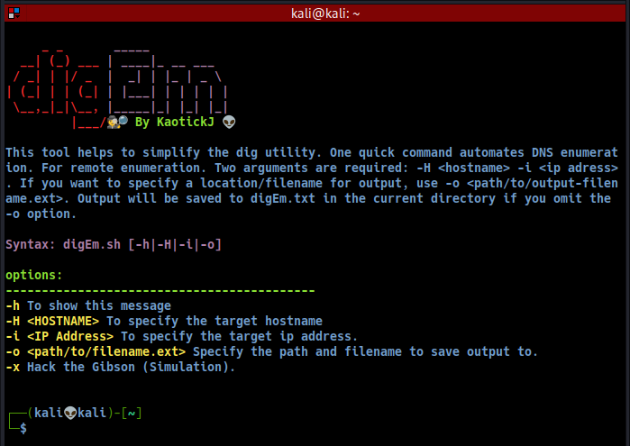

[](https://gist.github.com/cheerfulstoic/d107229326a01ff0f333a1d3476e068d) [](https://img.shields.io/badge/Version-0.1-green) [](https://github.com/kaotickj/DigEm/blob/main/LICENSE) [](https://www.gnu.org/software/bash/)

# DigEm 🕵🔎 ️

> This tool helps to simplify the dig utility. One quick command automates DNS enumeration. For remote enumeration.
Syntax: digEm.sh [-h|-H|-i|-o]

Options:
>-------------------------------------------

* -h To show help message
* -H <HOSTNAME> To specify the target hostname
* -i <IP Address> To specify the target ip address.
* -o <path/to/filename.ext> Specify the path and filename to save output to. If none, output will be saved to digEm.txt in the current directory.
* -x Hack the Gibson <Simulation>
>--------------------------------------------
##### Usage:
Two arguments are required: -H \<hostname\> -i \<ip adress\>.  If you want to specify a location/filename for output, use -o \<path/to/output-filename.ext\>. Output will be saved to digEm.txt in the current directory if you omit the -o option.  
```sh
./digEm.sh -H google.com -i 142.251.45.238 -o out.txt
cat out.txt
```
 